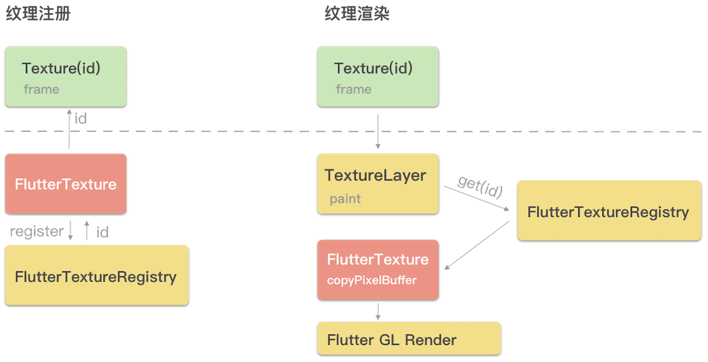

English| [简体中文](./直播播放.md)

## Basics

This document describes the live playback feature of the Player SDK. You can start by understanding the following basics:

- **Live streaming and video on demand**
In live streaming, the video source is pushed by the host in real time. When the host stops pushing the source, the player will also stop playing the video. Because the live stream is played back in real time, no progress bar will be displayed in the player during the playback.

 In video on demand (VOD), the video source is a video file in the cloud, which can be played back at any time as long as it is not deleted from the cloud. A progress bar is displayed for controlling the playback progress. Typical VOD scenarios include viewing videos on video websites such as Tencent Video and Youku Tudou.

- **Supported protocols**
Common live streaming protocols are as listed below. We recommend you use an FLV-based live streaming URL that starts with `http` and ends with `.flv` on apps.


## Notes
- **Are there any restrictions?**
The Player SDK **does not impose any limits on the sources of playback URLs**, which means that you can use it to play back videos from both Tencent Cloud and non-Tencent Cloud URLs. However, players in the SDK support only live streaming URLs in FLV, RTMP, and HLS (M3U8) formats, as well as VOD URLs in MP4, HLS (M3U8), and FLV formats.

- **Historical factors**
In early SDK versions, both live streaming and VOD features are implemented by the `TXLivePlayer` class. As more VOD features have been developed, in SDK versions 3.5 and later, VOD features are implemented by `TXVodPlayer`. However, to ensure that the project can be compiled successfully, you can still find some VOD features such as adjusting playback progress in `TXLivePlayer`.

## SDK Integration

### Step 1. Create a player
The `TXLivePlayer` module of the Player SDK (`TXLivePlayerController` in the Player SDK for Flutter) is used to implement the live playback feature.
```dart
TXLivePlayerController controller = TXLivePlayerController();
```

### Step 2. Render the view
Flutter uses widgets as the basic UI rendering unit. Therefore, to display the video image in the player, you simply need to prepare a widget and adjust the layout. You can directly use `TXPlayerVideo` or inherit it to display the video image, or you can implement a custom view by referring to the source code.

```dart
  @override
  Widget build(BuildContext context) {
    return Scaffold(
      appBar: AppBar(
        title: const Text('Live streaming'),
      ),
      body: SafeArea(
        child: Column(
          children: [
            Container(
              height: 150,
              color: Colors.black,
              child: Center(
                child: _aspectRatio>0?AspectRatio(
                  aspectRatio: _aspectRatio,
                  child: TXPlayerVideo(controller: _controller),
                ):Container(),
              ),
            ),],
        ),
      ),
    );
  }
```

Flutter internally provides a mechanism to share native textures with Flutter for rendering. The following figure uses iOS as an example to show how the official external texture mechanism works:



Blocks in red are the native code to be written, and blocks in yellow are the internal code logic of the Flutter engine. The entire process consists of texture registration and overall texture rendering logic.

### Registering texture

1. Create an object to implement the `FlutterTexture` protocol and manage specific texture data.
2. Use `FlutterTextureRegistry` to register the `FlutterTexture` object described in step 1 to get a Flutter texture ID.
3. Send the ID through the channel mechanism to Dart, where you can use the `Texture` widget and pass in the ID as the parameter to use the texture.

### Rendering texture

1. Create an object to implement the `FlutterTexture` protocol and manage specific texture data.
2. Use `FlutterTextureRegistry` to register the `FlutterTexture` object described in step 1 to get a Flutter texture ID.
3. Send the ID through the channel mechanism to Dart, where you can use the `Texture` widget and pass in the ID as the parameter to use the texture.
4. The Flutter engine calls `copyPixelBuffer` to get the specific texture data and uses GPU to render it at the underlying layer.

### Step 3. Start the playback
```dart
String flvUrl = "http://liteavapp.qcloud.com/live/liteavdemoplayerstreamid_demo1080p.flv";
await _controller.startLivePlay("flvUrl", playType: TXPlayType.LIVE_FLV);
```

| Option | Enumerated Value | Description |
|---------|---------|---------|
| PLAY_TYPE_LIVE_RTMP | 0 | The URL passed in is an RTMP live streaming URL |
| PLAY_TYPE_LIVE_FLV | 1 | The URL passed in is an FLV live streaming URL |
| PLAY_TYPE_LIVE_RTMP_ACC | 5 | The low-latency URL (applicable to only mic connect scenarios) |
| PLAY_TYPE_VOD_HLS | 3 | The URL passed in is an HLS (M3U8) playback URL|

> **Notes on HLS (M3U8)**
> We recommend you not use the HLS protocol to play back live streaming video sources in your app because the latency is too high (though HLS protocol is suitable for VOD). Instead, we recommend using LIVE_FLV and LIVE_RTMP playback protocols.

### Step 5. Pause the playback
Technically speaking, live playback cannot be paused. In this document, pausing the playback means **freezing the video image** and **disabling audio**, while the video source continues to be streamed in the cloud. When you call `resume`, the playback will start from the time of resumption. This is different from VOD, where when you pause or resume the playback, the player will behave the same way as it does when you pause or resume a local video file.

```dart
// Pause playback
_controller.pause();
// Resume playback
_controller.resume();
```

### Step 6. Stop the playback
```dart
// Stop playback
_controller.stop();
```

<h3 id="Message">Step 7. Receive a message</h3>
This feature is used to deliver custom messages from the publisher to the audience along with audio/video data. It is applicable to the following scenarios:
(1) Online quiz: The publisher delivers <strong>questions</strong> to the viewers with perfectly synced audio, image, and questions.
(2) Showroom streaming: The publisher delivers <strong>lyrics</strong> to the viewers. The lyrics can be displayed in real time in the player without being affected by video encoding quality degradation.
(3) Online education: The publisher delivers <strong>laser pointer</strong> and <strong>doodle</strong> operations to the viewers to circle and underline content in the player in real time.

You can use this feature as follows:
- Use **onPlayerEventBroadcast** to listen for the message **PLAY_EVT_GET_MESSAGE (2012)**.

```dart
_controller.onPlayerEventBroadcast.listen((event) {// Subscribe to the delivered event
    if(event["event"] == 2012) {
        String msg = event["EVT_GET_MSG"];
    }
});
```

### Step 7. Change video quality
During daily use, network conditions change constantly. When the network conditions are poor, switching to a lower image quality can reduce lag, and the higher quality video can be switched back when network conditions improve.
Traditionally, playback is interrupted when a stream is switched, which can cause problems such as video image discontinuity, black screen, and lag. With the seamless switch solution, you can switch to another stream without interrupting the live streaming.

The video quality change API can be called at any time after live streaming starts.
```objectivec
// The stream `http://5815.liveplay.myqcloud.com/live/5815_62fe94d692ab11e791eae435c87f075e.flv` is being played back
// Switch to a new stream with a bitrate of 900 Kbps
_controller.switchStream("http://5815.liveplay.myqcloud.com/live/5815_62fe94d692ab11e791eae435c87f075e_900.flv");
```

> You need to configure PTS alignment on the backend to use the seamless video quality change feature. To do this, please [submit a ticket](https://console.cloud.tencent.com/workorder).

<h2 id="Delay">Latency Adjustment</h2>
The live playback feature of the SDK is not based on FFmpeg, but Tencent Cloud's proprietary playback engine, which is why the SDK offers better latency control than open-source players do. We provide three latency control modes, which can be used for showrooms, game streaming, and hybrid scenarios.

- **Comparison of control modes**

| Control Mode | Lag Rate | Average Latency | Applicable Scenario | Description |
|---------|---------|---------| ------ | ----- |
| Expedited mode | Relatively high | 2s–3s| Live show (online quiz) | It has better latency control and is suitable for scenarios that require a low latency. |
| Smooth mode | Lowest | ≥ 5s | Game live streaming (Tencent Penguin eSports) | It is suitable for game live streaming scenarios with a high bitrate, such as battle royale games. |
| Auto mode | Network adaption | 2s–8s | Hybrid scenario | The better the audience's network, the shorter the latency, and vice versa. |


- **Code to integrate the three modes**

```dart
// Auto mode
_controller.setLiveMode(TXPlayerLiveMode.Automatic);
// Expedited mode
_controller.setLiveMode(TXPlayerLiveMode.Speed);
// Smooth mode
_controller.setLiveMode(TXPlayerLiveMode.Smooth);

// Start the playback after configuration
```

> For more information on stuttering and latency control, see [Video Stutter](https://intl.cloud.tencent.com/document/product/1071/39362).

<h2 id="RealTimePlay">Ultra low-latency playback</h2>
The live player supports live playback at a latency of about <strong>400 ms</strong>. It can be used in scenarios with very strict requirements for latency, such as <strong>remote claw machine</strong> and <strong>mic connect</strong>. You need to know the following information about this feature:

- **This feature is enabled by default**
This feature doesn't need to be enabled in advance, but the live stream must be in Tencent Cloud, because there are technical and other difficulties in implementing an ultra low-latency linkage across cloud service providers.

- **The playback URL must be configured with hotlink protection**
The playback URL cannot be a general CDN URL and must carry a hotlink protection signature. For more information on how to calculate a signature, see [Hotlink Protection URL Calculation](https://cloud.tencent.com/document/product/267/32735).

- **ACC must be specified as the playback type**
When calling the `startLivePlay` playback function, you need to set `type` to **PLAY_TYPE_LIVE_RTMP_ACC**, and the SDK will use the RTMP-UDP protocol to directly pull the live stream.

- **It has a limit on the number of streams played back concurrently**
Currently, a maximum of 10 streams can be played back concurrently. Because the cost of low-latency lines is much greater than CDN lines, we encourage users to use this feature only in scenarios that actually require high interaction rather than using it for scenarios which do not require extremely low latency.

- **The latency of OBS doesn't meet the requirements**
If [TXLivePusher](https://cloud.tencent.com/document/product/454/7879) is used, call [setVideoQuality](https://cloud.tencent.com/document/product/454/7879#7.-.E8.AE.BE.E5.AE.9A.E7.94.BB.E9.9D.A2.E6.B8.85.E6.99.B0.E5.BA.A6) to set `quality` to `MAIN_PUBLISHER` or `VIDEO_CHAT`. It’s difficult to achieve low latency with OBS because data tends to build up at the streaming end.

- **It is billed by playback duration**
This feature is billed by playback duration, and the fees are subject to the number of pulled streams, but not the audio/video stream bitrate. For pricing details, see [Pricing Overview](https://cloud.tencent.com/document/product/454/8008).

## SDK API List[](id:sdkList)

#### Initializing player

**Description**

This API is used to initialize the controller and request assignment of shared textures.

**API**

```dart
await _controller.initialize();
```

#### Playing back through URL

**Notice**

Starting from version 10.7.0, the Licence needs to be set through {@link SuperPlayerPlugin#setGlobalLicense} before it can be played successfully, otherwise the playback will fail (black screen), and it can only be set once globally. Live Licence, UGC Licence, and Player Licence can all be used. If you have not obtained the above Licence, you can quickly apply for a beta Licence for free To play, the official licence needs to be [purchased](https://cloud.tencent.com/document/product/881/74588#.E8.B4.AD.E4.B9.B0.E5.B9.B6.E6.96 .B0.E5.BB.BA.E6.AD.A3.E5.BC.8F.E7.89.88-license).

**Description**

This API is used to play back a video via URL.

**API**

```dart
_controller.startLivePlay(url);
```

**Parameter description**

| Parameter | Type | Description |
| ------ | ------ | ------------------ |
| url | String | The URL of the video to be played back. |
| playType | int | The supported live streaming type. This parameter is optional and is RTMP live streaming by default. |

#### Pausing playback

**Description**

This API is used to pause a video during playback.

**API**

```dart
_controller.pause();
```

#### Resuming playback

**Description**

This API is used to resume the playback of a paused video.

**API**

```dart
_controller.resume();
```

#### Stopping playback

**Description**

This API is used to stop a video being played back.

**API**

```dart
_controller.stop();
```
**Parameter description**

| Parameter | Type | Description |
| ------ | ------ | ------------------ |
| isNeedClear | bool | Whether to clear the last-frame image. |

#### Enabling/Disabling auto playback

**Description**

This API is used to set whether to automatically play back the video after calling `startLivePlay` to load the video URL.

**API**

```dart
_controller.setIsAutoPlay(true);
```

**Parameter description**

| Parameter | Type | Description |
| ------ | ------ | ------------------ |
| isAutoPlay | bool | Whether to play back the video automatically. |

#### Querying player playback status

**Description**

This API is used to query whether the player is currently playing a video.

**API**

```dart
_controller.isPlaying();
```

#### Muting/Unmuting playback

**Description**

This API is used to set whether to mute the current playback.

**API**

```dart
_controller.setMute(true);
```

**Parameter description**

| Parameter | Type | Description |
| ------ | ------ | ------------------ |
| mute | bool | Whether to mute the playback. |

#### Setting video volume level

**Description**

This API is used to set the video volume level.

**API**

```dart
_controller.setVolume(volume);
```

**Parameter description**

| Parameter | Type | Description |
| ------ | ------ | ------------------ |
| volume | int | Video volume level. Value range: 0–100. |

#### Setting live streaming mode

**Description**

This API is used to set the live streaming mode.

**API**

```dart
_controller.setLiveMode(mode);
```

**Parameter description**

| Parameter | Type | Description |
| ------ | ------ | ------------------ |
| mode | int | Live streaming mode, which can be set to auto, expedited, or smooth mode |

#### Setting appID

**Description**

This API is used to set the `appID` for cloud-based control.

**API**

```dart
_controller.setAppID(appId);
```

**Parameter description**

| Parameter | Type | Description |
| ------ | ------ | ------------------ |
| appId | int | The application ID. |

#### Resuming live playback

**Description**

This API is used to resume live playback from time-shifting playback.

**API**

```dart
_controller.resumeLive();
```

## Listening for SDK Events
All internal SDK status messages will be notified to you through `onPlayerEventBroadcast` (event notification) and `onPlayerNetStatusBroadcast` (status callback) messages.

### 1. Playback events
| Event ID | Code | Description |   
| :-------------------  |:-------- |  :------------------------ | 
| PLAY_EVT_CONNECT_SUCC     |  2001    | The server was connected.                |
| PLAY_EVT_RTMP_STREAM_BEGIN|  2002    | The server was connected and playback started (this is thrown only for an RTMP URL). |
| PLAY_EVT_RCV_FIRST_I_FRAME|  2003    | The network received the first renderable video data packet (IDR).  |
|PLAY_EVT_PLAY_BEGIN    |  2004|  Video playback started, and the loading icon animation (if any) ends. | 
|PLAY_EVT_PLAY_LOADING|  2007|  The video is being loaded. The `BEGIN` event will be reported if video playback resumes. |  
|PLAY_EVT_GET_MESSAGE|  2012|  It is used to receive a message in an audio/video stream. For more information, see [Message reception](#Message). |  

- **Don't hide the playback image after receiving `PLAY_LOADING`**
Because the length of time between `PLAY_LOADING` and `PLAY_BEGIN` is uncertain (it may be five seconds or five milliseconds), some customers hide the playback image upon `LOADING` and display the image upon `BEGIN`, which will cause serious image flashing (especially in live streaming). We recommend you place a translucent loading animation on top of the video playback image.

### 2. Stop events
| Event ID | Code | Description |   
| :-------------------  |:-------- |  :------------------------ | 
|PLAY_EVT_PLAY_END      |  2006|  Video playback ended.      | 
|PLAY_ERR_NET_DISCONNECT |  -2301  | The network was disconnected and could not be reconnected after multiple retries. You can restart the player to perform more connection retries. | 

- **How do I determine whether live streaming is over?**
Due to the varying implementation principles of different standards, no end events (error code 2006) are returned for many live streams. Instead, when a host stops pushing a stream, the SDK will soon find that data stream pull fails (`WARNING_RECONNECT`) and attempt to retry until the `PLAY_ERR_NET_DISCONNECT` event is thrown after three failed attempts.

 Therefore, both error codes 2006 and -2301 need to be listened for and used to determine the end of live streaming.


### 3. Warnings
You can ignore the following events, which are provided only based on the white box SDK design philosophy to sync the event information.

| Event ID | Code | Description |   
| :-------------------  |:-------- |  :------------------------ | 
| PLAY_WARNING_VIDEO_DECODE_FAIL   |  2101  | Failed to decode the current video frame.  |
| PLAY_WARNING_AUDIO_DECODE_FAIL   |  2102  | Failed to decode the current audio frame.  |
| PLAY_WARNING_RECONNECT           |  2103  | The network was disconnected, and automatic reconnection was performed (the `PLAY_ERR_NET_DISCONNECT` event will be thrown after three failed attempts). |
| PLAY_WARNING_RECV_DATA_LAG       |  2104  | Unstable transfer of packets from the network. This may be caused by insufficient downstream bandwidth or uneven outbound stream from the host. |
| PLAY_WARNING_VIDEO_PLAY_LAG      |  2105  | Video playback encountered lag.|
| PLAY_WARNING_HW_ACCELERATION_FAIL|  2106  | Failed to start the hardware decoder, and the software decoder was used instead.   |
| PLAY_WARNING_VIDEO_DISCONTINUITY |  2107  | Current video frames are discontinuous. Certain frames may be dropped. |
| PLAY_WARNING_DNS_FAIL            |  3001  | RTMP-DNS failed (thrown only for RTMP playback URLs). |
| PLAY_WARNING_SEVER_CONN_FAIL     |  3002  | RTMP server connection failed (thrown only for RTMP playback URLs). |
| PLAY_WARNING_SHAKE_FAIL          |  3003  | RTMP server handshake failed (thrown only for RTMP playback URLs). |


## Video Width and Height 

**What are the video width and height (resolution)?**
The SDK cannot get the video width and height only from a URL string. To get the values, the SDK needs to access the cloud server until enough information required for analyzing the video image size has been loaded. Therefore, the SDK can notify your application of the video information only via notifications. 

 The **onNetStatus** notification is triggered once every second to provide real-time feedback on the current status of the pusher. It can act as a dashboard to inform you of what is happening inside the SDK so you can better understand the current network conditions and video information.

|   Parameter                   |  Description                   |   
| :------------------------  |  :------------------------ | 
| NET_STATUS_CPU_USAGE     | Current instantaneous CPU utilization | 
| **NET_STATUS_VIDEO_WIDTH**  | Video resolution - width |
| **NET_STATUS_VIDEO_HEIGHT**| Video resolution - height |
|	NET_STATUS_NET_SPEED     | Current network data reception speed |
|	NET_STATUS_NET_JITTER    | Network jitter. The greater the jitter, the more unstable the network |
|	NET_STATUS_VIDEO_FPS     | Current video frame rate of streaming media    |
|	NET_STATUS_VIDEO_BITRATE | Current video bitrate in Kbps of streaming media |
|	NET_STATUS_AUDIO_BITRATE | Current audio bitrate in Kbps of streaming media |
|NET_STATUS_CACHE_SIZE    | Buffer (`jitterbuffer`) size. If the current buffer length is 0, lag will occur soon |
| NET_STATUS_SERVER_IP | Connected server IP | 

